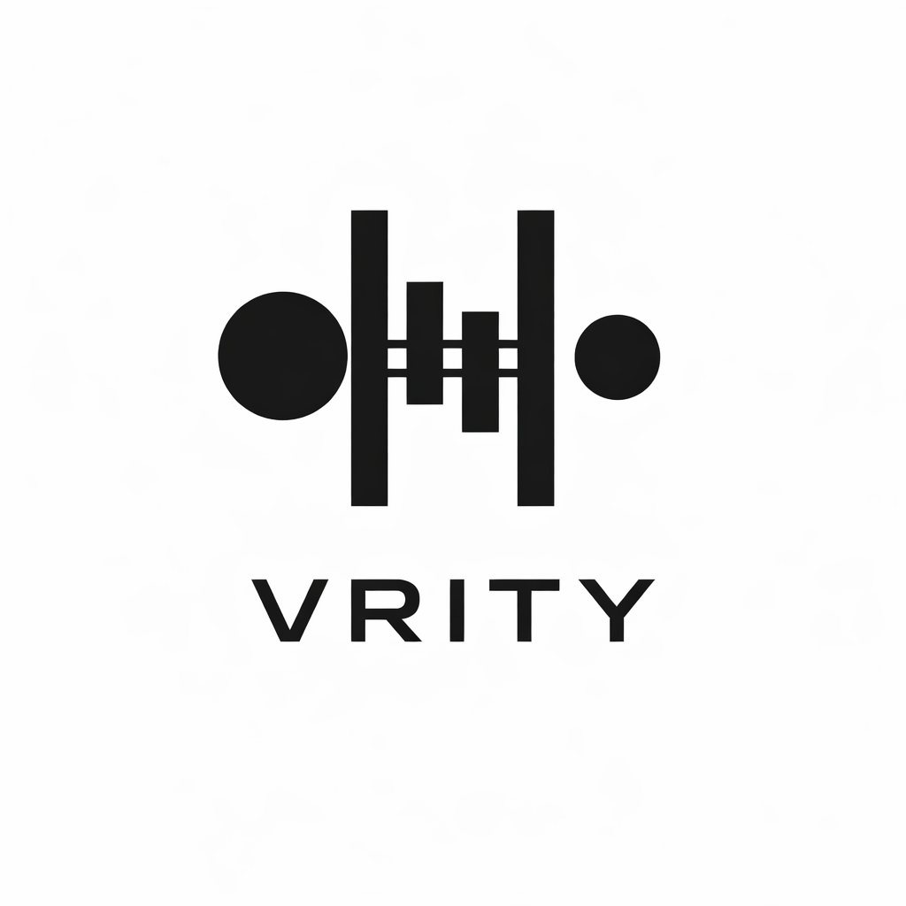

# Vrity

<p align="center">
  
</p>

<h1 align="center">VRITY</h1>

<p align="center">
  A security-first software registry.
</p>

> A trust-enforced JS registry.
> If it hasn’t been evaluated, it can’t be distributed.

Vrity is a JavaScript package registry that enforces security evaluation as part of the distribution lifecycle.

Unlike traditional registries where security is advisory, Vrity treats evaluation state as a distribution gate.

No scan. No install.
Critical vulnerability. No distribution.
No force override.

---

## Why Vrity?

Modern package distribution has a structural flaw:

* Publish → immediately available
* Install → always allowed
* Security → optional, advisory, or external

Vrity changes that contract.

Every published artifact in Vrity:

* Is evaluated for vulnerabilities
* Has a recorded dependency graph snapshot
* Has immutable metadata
* Has a distribution state

Distribution is conditional on evaluation state.

---

## Core Principles

### 1. Trust Boundary at the Registry

Vrity enforces security at the distribution layer — not as a CI plugin, not as a post-install audit.

### 2. No Silent Bypass

There is no `--force`.
There is no environment override.
There is no hidden backdoor.

If an artifact is blocked, it is blocked.

### 3. Deterministic Evaluation

Each publish records:

* Artifact digest
* Dependency graph hash
* Rule fingerprint
* Vulnerability snapshot timestamp
* Scan state

Evaluation state is frozen and auditable.

### 4. Monotonic Strictness

Rules can only become stricter (org/package-level).
Baseline cannot be weakened.

---

## How It Works

### Publish Lifecycle

1. Upload tarball
2. Secret scan
3. Dependency graph extraction

   * Use lockfile if present
   * Otherwise resolve server-side
4. Vulnerability evaluation via OSV
5. Assign distribution state
6. Append immutable log entry

### Artifact States

* `CLEAN` → install allowed
* `WARN_HIGH` → install allowed with warning
* `BLOCKED_CRITICAL` → install blocked
* `PENDING_SCAN` → install blocked until scan completes

---

## Baseline Security Rules (v0.1)

**Publish (Block):**

* `block_secrets`
* `block_critical_cve`

**Publish (Warn):**

* `warn_high_cve`

System invariants:

* Immutable artifacts
* Append-only publish log
* Dependency graph snapshot
* Provenance metadata
* Install gate enforcement

---

## Install Contract

An artifact can only be installed if:

* It has been evaluated
* It does not contain critical vulnerabilities

If security scan is pending, install is blocked.

---

## OSS + Cloud Model

Vrity is:

* **Open-source core** — self-hostable, transparent, auditable
* **Vrity Cloud** — managed offering with:

  * Hosted registry
  * Managed vulnerability sync
  * High-availability scanning
  * Enterprise operational guarantees

The security model is identical between OSS and Cloud.

Cloud does not weaken enforcement.

---

## Non-Goals (v0.1)

Vrity is not:

* A package manager replacement
* A full supply-chain signing platform (yet)
* A policy scripting engine
* A compliance dashboard
* A vulnerability scanner SaaS

It is a distribution gate with structural integrity.

---

## CLI Examples

Publish:

```
vrity publish
```

Verify:

```
vrity verify package@1.2.3
```

Install (npm-compatible):

```
npm install --registry=https://registry.vrity.dev
```

---

## Trust Guarantees

If a package installs from Vrity:

* It has been evaluated.
* It does not contain known critical vulnerabilities (at publish time).
* Its dependency graph was recorded.
* Its security state is auditable.

---

## Philosophy

Security should not be optional.
Distribution should not be blind.
Evaluation should not be advisory.

Vrity enforces these constraints at the registry layer.

---

## Roadmap (High-Level)

v0.1:

* Baseline security enforcement
* Immutable logs
* OSV-backed scanning
* Install gating

Future directions:

* CI-bound publishing
* Stronger provenance enforcement
* Attestation transparency log
* Supply-chain trust primitives

---

## Status

Vrity v0.1 is focused on correctness and structural integrity.
Feature surface is intentionally minimal.
